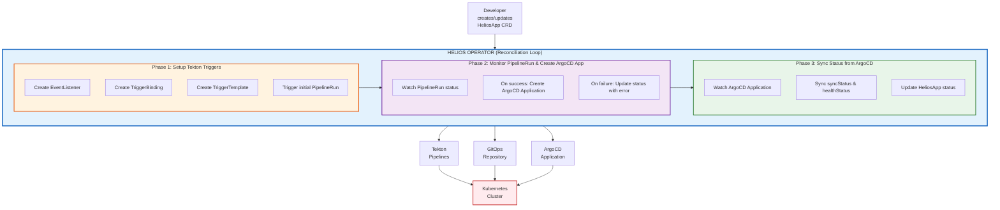
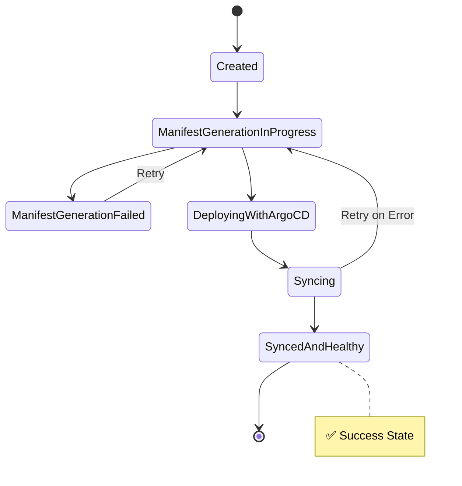

# Helios Operator Architecture

## Architecture Overview

Helios Operator is designed following the **3-Phase GitOps Workflow** model, combining the power of Tekton Pipelines and ArgoCD to fully automate the deployment process.

## Overall Architecture



## Detailed Components

### 1. HeliosApp CRD

Custom Resource Definition containing complete configuration:

```yaml
apiVersion: platform.helios.io/v1
kind: HeliosApp
spec:
  # Application source
  gitRepo: string # Git repo URL
  gitBranch: string # Git branch
  imageRepo: string # Container image

  # Tekton configuration
  pipelineName: string # Tekton Pipeline to use
  serviceAccount: string # SA with git credentials

  # GitOps template
  templateRepo: string # Helm/Kustomize templates
  templatePath: string # Path to template

  # GitOps destination
  gitopsRepo: string # Where to commit manifests
  gitopsPath: string # Path in gitops repo

  # Custom values
  values: map[string]string
```

### 2. Operator Controller

**File**: `internal/controller/heliosapp_controller.go`

**Reconciliation Logic**:

```go
func (r *HeliosAppReconciler) Reconcile(ctx, req) {
    // 1. Get HeliosApp
    heliosApp := &platformv1.HeliosApp{}

    // 2. Ensure Tekton Triggers exist (idempotent)
    ensureTektonTriggers(heliosApp)

    // 3. Check if new PipelineRun needed
    if needsNewPipelineRun(heliosApp) {
        createManifestGenerationPipelineRun(heliosApp)
        updateStatus(heliosApp, "ManifestGenerationInProgress")
        return Requeue(15s)
    }

    // 4. Check PipelineRun status
    pipelineRun := getPipelineRun(heliosApp)
    if pipelineRun.Running {
        return Requeue(10s)
    }
    if pipelineRun.Failed {
        updateStatus(heliosApp, "ManifestGenerationFailed")
        return Requeue(60s)
    }

    // 5. PipelineRun succeeded - create ArgoCD App
    if !argoAppExists(heliosApp) {
        createArgoApplication(heliosApp)
        updateStatus(heliosApp, "DeployingWithArgoCD")
    }

    // 6. Sync status from ArgoCD
    argoApp := getArgoApplication(heliosApp)
    syncStatusFromArgo(heliosApp, argoApp)

    if argoApp.Synced && argoApp.Healthy {
        updateStatus(heliosApp, "SyncedAndHealthy")
        return Result{} // Stable state
    }

    return Requeue(15s)
}
```

### 3. Tekton Integration

**File**: `internal/controller/tekton_resources.go`

**Functions**:

- `GenerateEventListener()`: Create webhook listener
- `GenerateTriggerBinding()`: Extract webhook data
- `GenerateTriggerTemplate()`: Template to create PipelineRun
- `GeneratePipelineRunForManifestGeneration()`: PipelineRun cho manifest generation

**Workflow**:

1. EventListener nhận webhook từ Git
2. TriggerBinding extract commit info
3. TriggerTemplate creates new PipelineRun
4. PipelineRun renders manifests → commits to GitOps repo

### 4. ArgoCD Integration

**Functions**:

- `GenerateArgoApplication()`: Tạo ArgoCD Application resource
- Config:
  - Source: GitOps repo tại path đã render
  - Destination: Kubernetes namespace
  - Auto-sync: enabled
  - Prune: enabled
  - Self-heal: enabled

## State Machine



## Generation-Based Reconciliation

Operator uses **Kubernetes Generation** to track changes:

```go
if heliosApp.Status.ObservedGeneration == heliosApp.Generation {
    // Spec unchanged, skip manifest regeneration
    return
}
```

**Benefits**:

- Only trigger PipelineRun when spec changes
- Don't waste resources on status updates
- Predictable behavior

## RBAC Permissions

```yaml
# HeliosApp CRD
- platform.helios.io/heliosapps: *

# Tekton Resources
- tekton.dev/pipelineruns: *
- triggers.tekton.dev/*: *

# ArgoCD Resources
- argoproj.io/applications: *

# Core Resources
- pods: get,list,watch
- services: *
- deployments: *
```

## Monitoring & Observability

### Metrics

- Reconciliation duration
- PipelineRun success rate
- ArgoCD sync status
- Error counts by phase

### Logging

- Structured logging với logr
- Log levels: debug, info, error
- Correlation IDs cho tracking

### Status Conditions

```yaml
status:
  conditions:
    - type: Ready
      status: True/False
      reason: SyncedAndHealthy | ManifestGenerationFailed | ...
      message: Human-readable description
```

## Scalability

- **Horizontal**: Deploy multiple operator replicas
- **Leader Election**: Chỉ 1 replica active tại một thời điểm
- **Resource Limits**: Configure in `config/manager/manager.yaml`

## Security

- **ServiceAccount**: Least privilege principle
- **RBAC**: Fine-grained permissions
- **Secrets**: Git credentials, webhook secrets
- **Network Policies**: Restrict traffic

## Extensibility

### Custom Pipelines

Create Tekton Pipeline with different name:

```yaml
spec:
  pipelineName: my-custom-pipeline
```

### Custom Values

Truyền values cho template rendering:

```yaml
spec:
  values:
    replicas: "5"
    ingress.enabled: "true"
```

### Hooks

Future: Pre/post deployment hooks

## Performance

- **Requeue Intervals**:
  - Normal: 15s
  - Fast check: 10s
  - Error retry: 60s
- **Caching**: Client-side caching cho Kubernetes API

## Comparison with Alternatives

| Feature             | Helios | Flux | Argo Workflows |
| ------------------- | ------ | ---- | -------------- |
| Manifest Generation | ✅     | ❌   | ⚠️             |
| Auto ArgoCD Setup   | ✅     | ❌   | ❌             |
| Single CRD          | ✅     | ❌   | ❌             |
| Tekton Integration  | ✅     | ❌   | ⚠️             |

## References

- [Kubebuilder Book](https://book.kubebuilder.io/)
- [Tekton Documentation](https://tekton.dev/docs/)
- [ArgoCD Documentation](https://argo-cd.readthedocs.io/)
