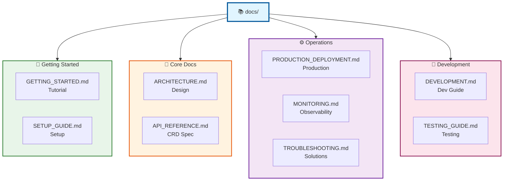

# Helios Operator Documentation

Comprehensive documentation for using, developing, and maintaining Helios Operator.

## 📚 Table of Contents

### Getting Started

- **[Getting Started Guide](./GETTING_STARTED.md)** - Step-by-step guide to setup and use Helios

  - Prerequisites & Installation
  - Create first HeliosApp
  - Verify deployment
  - Common workflows

- **[Setup Guide](./SETUP_GUIDE.md)** - Detailed setup instructions
  - Kubernetes cluster setup
  - Dependencies installation
  - Configuration options
  - Production considerations

### Core Documentation

- **[Architecture](./ARCHITECTURE.md)** - Detailed architecture and design decisions

  - 3-Phase GitOps Workflow
  - Component interactions
  - State machine
  - Reconciliation logic
  - Performance & scalability

- **[API Reference](./API_REFERENCE.md)** - Complete CRD specification
  - All spec fields explained
  - Status fields & conditions
  - Validation rules
  - Complete examples
  - Best practices

### Operations

- **[Production Deployment](./PRODUCTION_DEPLOYMENT.md)** - Best practices for production

  - High availability setup
  - Security hardening
  - Resource planning
  - Backup & recovery
  - Upgrade procedures

- **[Monitoring & Observability](./MONITORING.md)** - Setup monitoring stack

  - Prometheus metrics
  - Grafana dashboards
  - Alerting rules
  - Log aggregation
  - Health checks

- **[Troubleshooting Guide](./TROUBLESHOOTING.md)** - Common issues and solutions
  - Deployment issues
  - Tekton problems
  - ArgoCD issues
  - Debugging tools
  - Support resources

### Development

- **[Development Guide](./DEVELOPMENT.md)** - Development workflow

  - Development environment setup
  - Build & test locally
  - Code guidelines
  - CI/CD pipeline
  - Release process

- **[Testing Guide](./TESTING_GUIDE.md)** - Testing strategies
  - Unit tests
  - E2E tests
  - Manual testing
  - Coverage reports

## 🚀 Quick Links

### For Users

| I want to...            | Go to...                                                                              |
| ----------------------- | ------------------------------------------------------------------------------------- |
| Deploy my first app     | [Getting Started Guide](./GETTING_STARTED.md)                                         |
| Install in production   | [Setup Guide](./SETUP_GUIDE.md) → [Production Deployment](./PRODUCTION_DEPLOYMENT.md) |
| Understand how it works | [Architecture](./ARCHITECTURE.md)                                                     |
| Check API specification | [API Reference](./API_REFERENCE.md)                                                   |
| Fix an issue            | [Troubleshooting Guide](./TROUBLESHOOTING.md)                                         |
| Setup monitoring        | [Monitoring Guide](./MONITORING.md)                                                   |

### For Operators

| I want to...         | Go to...                                                              |
| -------------------- | --------------------------------------------------------------------- |
| Deploy to production | [Production Deployment](./PRODUCTION_DEPLOYMENT.md)                   |
| Setup HA cluster     | [Production Deployment](./PRODUCTION_DEPLOYMENT.md#high-availability) |
| Configure monitoring | [Monitoring Guide](./MONITORING.md)                                   |
| Handle incidents     | [Troubleshooting Guide](./TROUBLESHOOTING.md)                         |
| Upgrade operator     | [Production Deployment](./PRODUCTION_DEPLOYMENT.md#upgrades)          |

### For Developers

| I want to...            | Go to...                                                            |
| ----------------------- | ------------------------------------------------------------------- |
| Setup dev environment   | [Development Guide](./DEVELOPMENT.md#development-environment-setup) |
| Run tests               | [Testing Guide](./TESTING_GUIDE.md)                                 |
| Understand architecture | [Architecture](./ARCHITECTURE.md)                                   |
| Build locally           | [Development Guide](./DEVELOPMENT.md#build--run-locally)            |

## 📖 Learning Paths

### Beginner Track (New Users)

1. **Start here**: [Getting Started Guide](./GETTING_STARTED.md) - Step-by-step tutorial
2. **Learn basics**: [Architecture](./ARCHITECTURE.md) - Understand 3-phase workflow
3. **Try examples**: Check `../config/samples/` - Sample HeliosApp manifests
4. **Deep dive**: [API Reference](./API_REFERENCE.md) - Full CRD specification

**Estimated time**: 2-3 hours

### Operations Track (Production Deployment)

1. **Prerequisites**: [Setup Guide](./SETUP_GUIDE.md) - Infrastructure requirements
2. **Deploy**: [Production Deployment](./PRODUCTION_DEPLOYMENT.md) - HA setup, security
3. **Monitor**: [Monitoring Guide](./MONITORING.md) - Metrics, alerts, dashboards
4. **Maintain**: [Troubleshooting Guide](./TROUBLESHOOTING.md) - Common issues

**Estimated time**: 1 day for initial setup

### Development Track (Contributors)

1. **Setup**: [Development Guide](./DEVELOPMENT.md) - Dev environment
2. **Understand**: [Architecture](./ARCHITECTURE.md) - Internal design
3. **Test**: [Testing Guide](./TESTING_GUIDE.md) - Run tests locally
4. **Build**: [Development Guide](./DEVELOPMENT.md#build--deploy) - Build & deploy

**Estimated time**: Half day to get started

## 🔍 Find What You Need

### By Topic

#### Installation & Setup

- [Getting Started](./GETTING_STARTED.md#installation) - Quick install
- [Setup Guide](./SETUP_GUIDE.md) - Detailed setup
- [Production Deployment](./PRODUCTION_DEPLOYMENT.md#installation) - Production install

#### Configuration

- [API Reference](./API_REFERENCE.md#spec-fields) - All configuration options
- [Getting Started](./GETTING_STARTED.md#create-first-heliosapp) - Basic config
- Examples: `../config/samples/` - Sample configurations

#### Running & Operating

- [Monitoring](./MONITORING.md) - Metrics & observability
- [Troubleshooting](./TROUBLESHOOTING.md) - Problem solving
- [Production Deployment](./PRODUCTION_DEPLOYMENT.md#operations) - Day-2 operations

#### Contributing & Developing

- [Development Guide](./DEVELOPMENT.md) - Dev workflow
- [Testing Guide](./TESTING_GUIDE.md) - Testing strategies
- [Architecture](./ARCHITECTURE.md#extensibility) - Extend functionality

### By Use Case

**"I want to deploy my first app"**  
→ [Getting Started Guide](./GETTING_STARTED.md)

**"My HeliosApp is stuck in Pending"**  
→ [Troubleshooting Guide](./TROUBLESHOOTING.md#heliosapp-stuck-in-pending)

**"How do I configure ArgoCD settings?"**  
→ [API Reference](./API_REFERENCE.md#argocd-configuration)

**"What's the GitOps workflow?"**  
→ [Architecture](./ARCHITECTURE.md#overall-architecture)

**"How do I setup monitoring?"**  
→ [Monitoring Guide](./MONITORING.md#prometheus-setup)

**"I want to develop locally"**  
→ [Development Guide](./DEVELOPMENT.md#local-development)

## 📝 Documentation Standards

All documentation follows these principles:

- ✅ **Clear structure** with table of contents
- ✅ **Practical examples** with working code
- ✅ **Troubleshooting tips** for common issues
- ✅ **Cross-references** to related documentation
- ✅ **Up-to-date** with latest version
- ✅ **Mermaid diagrams** for visual clarity

## 🗺️ Documentation Map

## 🙏 Get Help

- 📖 **Documentation**: Browse guides in this directory
- 👥 **Team**: Contact team members directly
- 💬 **Internal**: Use team communication channels

---

**Last Updated**: October 18, 2025  
**Version**: v1.0.0  
**Maintained by**: Helios Team @ HCMUS
