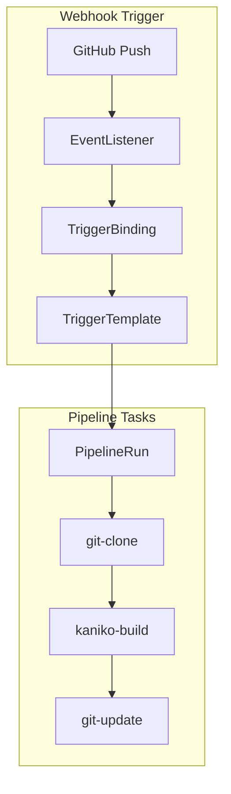
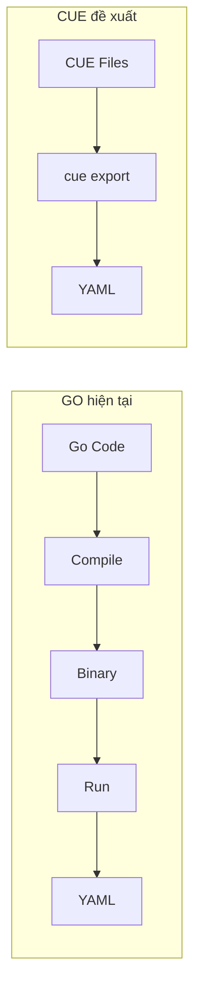
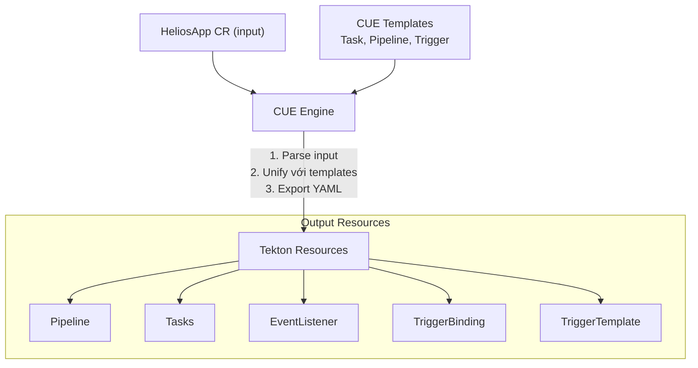
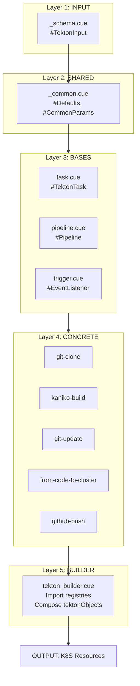
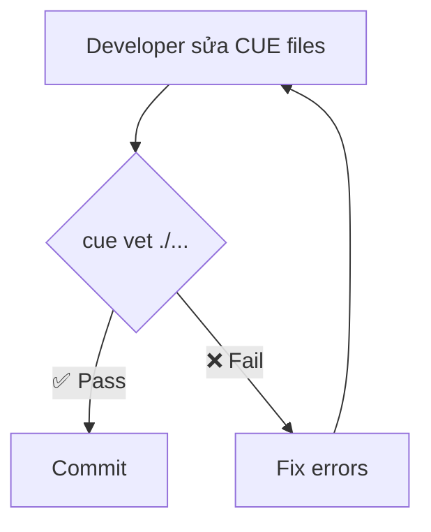
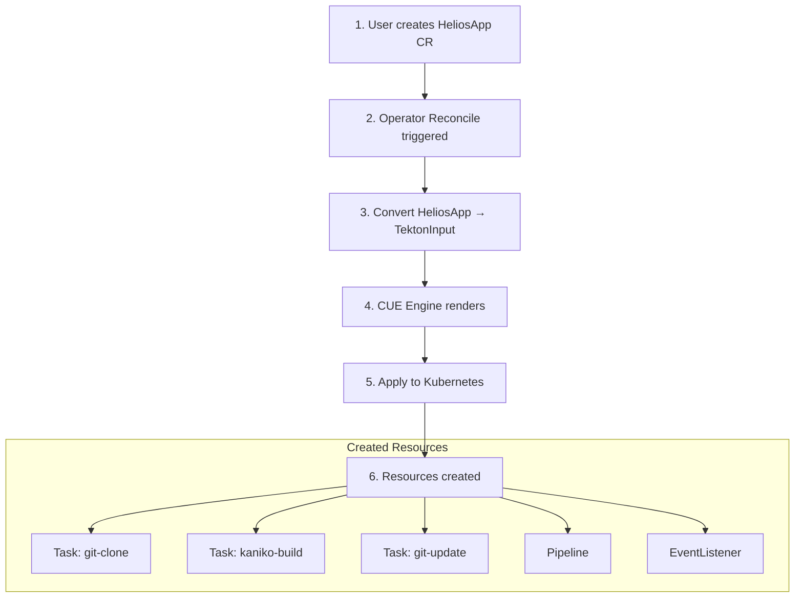
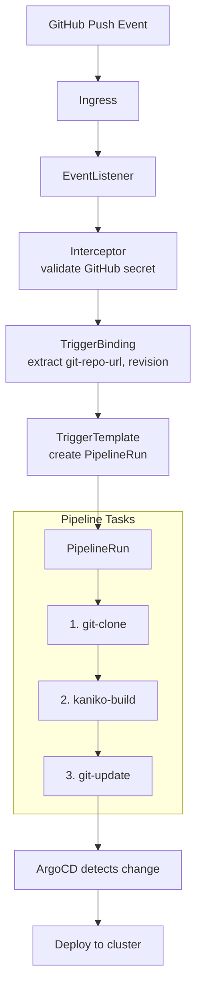

# Detailed Design: Tekton to CUE Migration

> **Author:** Phước Hoàn
> **Date:** 2026-02-04  
> **Version:** 3.0  
> **Status:** Draft - Pending Review  
> **Issue:** [Analysis] Map Tekton Resources to CUE Schema #18

---

## Mục lục

1. [Bối cảnh & Vấn đề](#1-bối-cảnh--vấn-đề)
2. [CUE là gì?](#2-cue-là-gì)
3. [Giải pháp đề xuất](#3-giải-pháp-đề-xuất)
4. [Kiến trúc tổng quan](#4-kiến-trúc-tổng-quan)
5. [Chi tiết thiết kế](#5-chi-tiết-thiết-kế)
6. [Luồng hoạt động](#6-luồng-hoạt-động)
7. [Hướng dẫn triển khai](#7-hướng-dẫn-triển-khai)
8. [Mở rộng trong tương lai](#8-mở-rộng-trong-tương-lai)
9. [Tham khảo](#9-tham-khảo)

---

## 1. Bối cảnh & Vấn đề

### 1.1 Tekton là gì?

**Tekton** là một framework CI/CD chạy trên Kubernetes. Trong Helios Platform, Tekton được dùng để:

1. **Clone source code** từ GitHub
2. **Build Docker image** với Kaniko
3. **Push image** lên registry (Docker Hub, GCR, ...)
4. **Update manifest** trong GitOps repo



### 1.2 Vấn đề hiện tại

Hiện tại, các Tekton resources được tạo bằng **Go code hardcoded** trong file `tekton_resources.go`:

```go
// Ví dụ code hiện tại - khó maintain
func GeneratePipeline(namespace string) *unstructured.Unstructured {
    return &unstructured.Unstructured{
        Object: map[string]any{
            "apiVersion": "tekton.dev/v1beta1",
            "kind":       "Pipeline",
            "metadata": map[string]any{
                "name":      "from-code-to-cluster",
                "namespace": namespace,
            },
            "spec": map[string]any{
                "params": []any{
                    map[string]any{"name": "app-repo-url"},
                    // ... 100+ dòng tiếp theo
                },
            },
        },
    }
}
```

**Các vấn đề:**

| Vấn đề | Mô tả | Ảnh hưởng |
|--------|-------|-----------|
| **Khó đọc** | YAML nằm trong Go map, khó hình dung cấu trúc | Dev mới khó hiểu |
| **Khó sửa** | Thêm field mới phải sửa Go code, rebuild | Chậm iteration |
| **Không type-safe** | Go không validate cấu trúc Tekton | Lỗi runtime |
| **Duplicate** | Mỗi task/pipeline là hàm riêng, copy-paste | Inconsistent |
| **Khó test** | Phải chạy operator để test output | Slow feedback |

### 1.3 Mục tiêu

Chuyển từ Go hardcoded sang **CUE language**:

- ✅ Khai báo YAML-like, dễ đọc
- ✅ Type-safe, validate compile-time  
- ✅ Reusable patterns
- ✅ Test được mà không cần chạy Operator
- ✅ Dễ mở rộng thêm pipeline mới

---

## 2. CUE là gì?

### 2.1 Giới thiệu CUE

**CUE** (Configure Unify Execute) là ngôn ngữ cấu hình được tạo bởi Marcel van Lohuizen (cựu Google, làm việc trên Go và Borg).

CUE kết hợp:

- **JSON superset**: Viết config như JSON/YAML
- **Types**: Định nghĩa schema, validate dữ liệu
- **Logic**: Unification, constraints, defaults

### 2.2 So sánh với YAML/Go

```yaml
# YAML: Không có types
apiVersion: tekton.dev/v1beta1
kind: Pipeline
metadata:
  name: "123"  # Sai tên nhưng YAML không biết
spec:
  params:
    - name: url
      default: 123  # Số nhưng nên là string
```

```cue
// CUE: Có types, validate compile-time
#Pipeline: {
    apiVersion: "tekton.dev/v1beta1"
    kind:       "Pipeline"
    metadata: {
        name: =~"^[a-z][a-z0-9-]*$"  // Regex validation
    }
    spec: {
        params: [...{
            name:    string
            default: string | *""  // Phải là string, default rỗng
        }]
    }
}
```

### 2.3 Các khái niệm CUE cần biết

#### 2.3.1 Definitions (`#`)

Định nghĩa schema/template với prefix `#`:

```cue
// Definition - không xuất ra output trực tiếp
#Person: {
    name: string
    age:  int & >=0 & <=150  // Constraint: 0-150
}

// Concrete value - dùng definition
john: #Person & {
    name: "John"
    age:  30
}
```

#### 2.3.2 Unification (`&`)

Gộp hai giá trị lại, phải tương thích:

```cue
a: {x: 1}
b: {y: 2}
c: a & b  // c = {x: 1, y: 2}

// Conflict sẽ lỗi
d: {x: 1}
e: {x: 2}
f: d & e  // ERROR: x: conflicting values 1 and 2
```

#### 2.3.3 Default values (`*`)

```cue
#Config: {
    port:    int | *8080     // Default 8080
    debug:   bool | *false   // Default false
    timeout: string | *"30s"
}

myConfig: #Config & {
    port: 3000  // Override
    // debug và timeout dùng default
}
```

#### 2.3.4 String interpolation

```cue
name: "myapp"
namespace: "default"

fullName: "\(namespace)/\(name)"  // "default/myapp"
```

### 2.4 Lợi ích của CUE cho Tekton



| Approach | Thay đổi | Test |
|----------|----------|------|
| **Go** | Recompile | Chạy operator |
| **CUE** | Edit text file | `cue export` (instant) |

---

## 3. Giải pháp đề xuất

### 3.1 Ý tưởng chính

Thay vì viết Go code tạo YAML, ta viết **CUE templates** và dùng **CUE Engine** để render ra YAML.



### 3.2 Design Principles

| Principle | Áp dụng như thế nào |
|-----------|---------------------|
| **DRY** | Shared params trong `_common.cue` |
| **Open/Closed** | Thêm task mới = thêm file, không sửa code cũ |
| **Single Responsibility** | Mỗi file = 1 resource type |
| **Composition** | Pipeline ghép từ patterns |
| **Convention > Config** | Defaults cho mọi optional fields |

---

## 4. Kiến trúc tổng quan

### 4.1 Cấu trúc thư mục

```plaintext
cue/
├── cue.mod/
│   └── module.cue           # Package declaration
│
├── definitions/
│   └── tekton/
│       │
│       ├── _schema.cue      # INPUT: Định nghĩa dữ liệu đầu vào
│       ├── _common.cue      # SHARED: Params, defaults dùng chung
│       │
│       ├── bases/           # BASE TEMPLATES: Cấu trúc K8S resource
│       │   ├── task.cue     # #TektonTask template
│       │   ├── pipeline.cue # #TektonPipeline template
│       │   └── trigger.cue  # #TriggerBinding, #EventListener, ...
│       │
│       ├── tasks/           # CONCRETE TASKS: Tasks cụ thể
│       │   ├── _registry.cue
│       │   ├── git-clone.cue
│       │   ├── kaniko-build.cue
│       │   └── git-update.cue
│       │
│       ├── pipelines/       # CONCRETE PIPELINES
│       │   ├── _registry.cue
│       │   ├── _patterns.cue
│       │   └── from-code-to-cluster.cue
│       │
│       └── triggers/        # CONCRETE TRIGGERS
│           ├── _patterns.cue
│           └── github-push.cue
│
└── engine/
    └── tekton_builder.cue   # BUILDER: Ghép tất cả lại
```

### 4.2 Luồng dữ liệu



---

## 5. Chi tiết thiết kế

### 5.1 Input Schema (`_schema.cue`)

**Mục đích:** Định nghĩa dữ liệu mà Operator sẽ truyền vào CUE Engine.

**Tương ứng với:** Các fields trong HeliosApp CRD (`heliosapp_types.go`)

```cue
package tekton

// #TektonInput: Contract giữa Go Operator và CUE Engine
// Operator sẽ convert HeliosApp CR thành struct này
#TektonInput: {
    // === IDENTITY ===
    appName:   string & =~"^[a-z][a-z0-9-]*$"  // K8S name format
    namespace: string
    
    // === SOURCE CODE ===
    gitRepo:   string & =~"^https?://.*"  // URL validation
    gitBranch: string | *"main"
    
    // === CONTAINER IMAGE ===
    imageRepo: string  // e.g. "docker.io/myuser/myapp"
    
    // === GITOPS ===
    gitopsRepo:   string
    gitopsPath:   string
    gitopsBranch: string | *"main"
    gitopsSecret: string | *"github-credentials"
    
    // === WEBHOOK (optional) ===
    webhookDomain?: string  // Nếu không có, không tạo EventListener
    webhookSecret:  string | *"github-credentials"
    
    // === PIPELINE CONFIG ===
    pipelineName:   string | *"from-code-to-cluster"
    serviceAccount: string | *"default"
    pvcName:        string | *"shared-workspace-pvc"
    contextSubpath: string | *""
    
    // === APP CONFIG ===
    replicas: int & >=1 | *1
    port:     int & >=1 & <=65535 | *8080
    
    // === SECRETS ===
    dockerSecret: string | *"docker-credentials"
}
```

**Giải thích:**

- `string & =~"..."`: String phải match regex
- `| *"main"`: Default value là "main"
- `?:`: Optional field
- `>=1 & <=65535`: Range constraint

### 5.2 Shared Definitions (`_common.cue`)

**Mục đích:** Tập trung mọi giá trị dùng chung, thay đổi một nơi áp dụng mọi nơi.

```cue
package tekton

// =====================================================
// DEFAULTS: Giá trị mặc định cho toàn bộ hệ thống
// Thay đổi ở đây = thay đổi cho tất cả tasks/pipelines
// =====================================================
#Defaults: {
    // Container images - PIN VERSION, không dùng :latest
    images: {
        gitClone: "alpine/git:v2.43.0"
        kaniko:   "gcr.io/kaniko-project/executor:v1.19.2"
        alpine:   "alpine:3.19"
    }
    
    // Secret names
    secrets: {
        docker: "docker-credentials"
        github: "github-credentials"
    }
    
    // Tekton defaults
    tekton: {
        apiVersion:     "tekton.dev/v1beta1"
        triggerVersion: "triggers.tekton.dev/v1beta1"
        serviceAccount: "tekton-triggers-sa"
    }
}

// =====================================================
// COMMON PARAMS: Định nghĩa params dùng lại
// Tránh copy-paste param definitions
// =====================================================
#CommonParams: {
    // Git params - dùng trong git-clone task
    git: {
        url: {
            name:        "url"
            description: "Repository URL to clone"
            type:        "string"
        }
        revision: {
            name:        "revision"
            description: "Git revision (branch, tag, or commit SHA)"
            type:        "string"
            default:     "main"
        }
    }
    
    // Image params - dùng trong kaniko-build
    image: {
        name: {
            name:        "IMAGE"
            description: "Full image name with registry and tag"
            type:        "string"
        }
        dockerfile: {
            name:    "DOCKERFILE"
            default: "Dockerfile"
        }
        contextSubpath: {
            name:        "CONTEXT_SUBPATH"
            description: "Subdirectory where Dockerfile is located"
            default:     ""
        }
    }
    
    // GitOps params - dùng trong git-update task
    gitops: {
        repoUrl: {
            name: "GITOPS_REPO_URL"
        }
        branch: {
            name:    "GITOPS_REPO_BRANCH"
            default: "main"
        }
        manifestPath: {
            name: "MANIFEST_PATH"
        }
    }
}

// =====================================================
// LABELS: Labels thêm vào mọi resource
// =====================================================
#CommonLabels: {
    "helios.io/managed-by": "operator"
    "app.kubernetes.io/part-of": "helios-platform"
}
```

### 5.3 Base Template: Task (`bases/task.cue`)

**Mục đích:** Template cơ bản cho mọi Tekton Task, đảm bảo structure đúng.

```cue
package tekton

// #TektonTask: Template cho Tekton Task
// Concrete tasks sẽ unify với template này
#TektonTask: {
    // === INPUT (phải cung cấp) ===
    parameter: {
        name:      string
        namespace: string
    }
    
    // === CONFIG (có thể override) ===
    config: {
        params:     [...#TaskParam] | *[]
        workspaces: [...#Workspace] | *[]
        results:    [...#Result] | *[]
        steps:      [...#Step]              // Required
        volumes:    [...#Volume] | *[]
    }
    
    // === OUTPUT (CUE tự generate) ===
    output: {
        apiVersion: #Defaults.tekton.apiVersion
        kind:       "Task"
        metadata: {
            name:      parameter.name
            namespace: parameter.namespace
            labels:    #CommonLabels
        }
        spec: {
            // Chỉ include field nếu có giá trị
            if len(config.params) > 0 {
                params: config.params
            }
            if len(config.workspaces) > 0 {
                workspaces: config.workspaces
            }
            if len(config.results) > 0 {
                results: config.results
            }
            steps: config.steps
            if len(config.volumes) > 0 {
                volumes: config.volumes
            }
        }
    }
}

// === SUPPORTING TYPES ===

#TaskParam: {
    name:         string
    description?: string
    type?:        "string" | "array"
    default?:     string
}

#Workspace: {
    name:         string
    description?: string
    optional?:    bool
    readOnly?:    bool
}

#Result: {
    name:         string
    description?: string
}

#Step: {
    name:  string
    image: string
    
    // Một trong hai: script HOẶC command
    {script: string} | {command: [...string], args?: [...string]}
    
    workingDir?:   string
    env?:          [...{name: string, value: string}]
    volumeMounts?: [...{name: string, mountPath: string}]
}

#Volume: {
    name: string
    // Một trong các loại volume
    {secret: {secretName: string, items?: [...{key: string, path: string}]}} |
    {emptyDir: {}} |
    {configMap: {name: string}}
}
```

**Cách dùng:**

```cue
// Concrete task sử dụng template
#MyTask: #TektonTask & {
    parameter: {
        name: "my-task"
        // namespace từ input
    }
    config: {
        steps: [{
            name: "step1"
            image: "alpine"
            script: "echo hello"
        }]
    }
}
// output sẽ tự động có đúng structure
```

### 5.4 Concrete Task: git-clone (`tasks/git-clone.cue`)

**Mục đích:** Task clone source code từ Git repository.

```cue
package tekton

#GitCloneTask: #TektonTask & {
    // Default name, có thể override
    parameter: {
        name: "git-clone"
    }
    
    config: {
        // Reuse param definitions từ _common.cue
        params: [
            #CommonParams.git.url,
            #CommonParams.git.revision,
        ]
        
        workspaces: [{
            name:        "output"
            description: "Workspace to clone source code into"
        }]
        
        steps: [{
            name:  "clone"
            image: #Defaults.images.gitClone
            
            // Multi-line script with #"""..."""# syntax
            script: #"""
                #!/bin/sh
                set -ex
                
                # Clean workspace
                rm -rf $(workspaces.output.path)/*
                rm -rf $(workspaces.output.path)/.[!.]*
                
                # Clone repo
                git clone $(params.url) $(workspaces.output.path)
                
                # Checkout revision
                cd $(workspaces.output.path)
                git checkout $(params.revision)
                
                echo "✅ Cloned $(params.url) at $(params.revision)"
                """#
        }]
    }
}
```

### 5.5 Pipeline Patterns (`pipelines/_patterns.cue`)

**Mục đích:** Reusable blocks để ghép thành pipeline.

```cue
package tekton

// Pattern: Tham chiếu đến git-clone task
#FetchSourcePattern: {
    // Có thể customize workspace name
    _workspace: string | *"source-workspace"
    
    name: "fetch-source-code"
    taskRef: name: "git-clone"
    workspaces: [{
        name:      "output"
        workspace: _workspace
    }]
    params: [
        {name: "url", value: "$(params.app-repo-url)"},
        {name: "revision", value: "$(params.app-repo-revision)"},
    ]
}

// Pattern: Build image với Kaniko
#BuildImagePattern: {
    _workspace: string | *"source-workspace"
    _runAfter:  [...string] | *["fetch-source-code"]
    
    name: "build-and-push-image"
    taskRef: name: "kaniko-build"
    runAfter: _runAfter
    workspaces: [{
        name:      "source"
        workspace: _workspace
    }]
    params: [
        {name: "IMAGE", value: "$(params.image-repo):$(params.app-repo-revision)"},
        {name: "CONTEXT_SUBPATH", value: "$(params.context-subpath)"},
        {name: "docker-secret", value: "$(params.docker-secret)"},
    ]
}

// Pattern: Update GitOps repo
#UpdateGitOpsPattern: {
    _workspace:      string | *"gitops-workspace"
    _credsWorkspace: string | *"git-credentials-workspace"
    _runAfter:       [...string] | *["build-and-push-image"]
    
    name: "update-gitops-manifest"
    taskRef: name: "git-update-manifest"
    runAfter: _runAfter
    workspaces: [
        {name: "gitops-repo", workspace: _workspace},
        {name: "git-credentials", workspace: _credsWorkspace},
    ]
    params: [
        {name: "GITOPS_REPO_URL", value: "$(params.gitops-repo-url)"},
        {name: "MANIFEST_PATH", value: "$(params.manifest-path)"},
        {name: "NEW_IMAGE_URL", value: "$(tasks.build-and-push-image.results.IMAGE_URL)"},
        {name: "GITOPS_REPO_BRANCH", value: "$(params.gitops-branch)"},
    ]
}
```

### 5.6 Base Template: Pipeline (`bases/pipeline.cue`)

**Mục đích:** Template cơ bản cho Tekton Pipeline.

```cue
package tekton

// #TektonPipeline: Template cho Tekton Pipeline
#TektonPipeline: {
    // === INPUT ===
    parameter: {
        name:      string
        namespace: string
    }
    
    // === CONFIG ===
    config: {
        params:     [...#PipelineParam] | *[]
        workspaces: [...#PipelineWorkspace] | *[]
        tasks:      [...#PipelineTask]
    }
    
    // === OUTPUT ===
    output: {
        apiVersion: #Defaults.tekton.apiVersion
        kind:       "Pipeline"
        metadata: {
            name:      parameter.name
            namespace: parameter.namespace
            labels:    #CommonLabels
        }
        spec: {
            if len(config.params) > 0 {
                params: config.params
            }
            if len(config.workspaces) > 0 {
                workspaces: config.workspaces
            }
            tasks: config.tasks
        }
    }
}

// === SUPPORTING TYPES ===

#PipelineParam: {
    name:     string
    default?: string
}

#PipelineWorkspace: {
    name:      string
    optional?: bool
}

#PipelineTask: {
    name:      string
    taskRef:   {name: string}
    runAfter?: [...string]
    params?:   [...{name: string, value: string}]
    workspaces?: [...{name: string, workspace: string}]
}
```

### 5.7 Main Pipeline (`pipelines/from-code-to-cluster.cue`)

**Mục đích:** Pipeline chính, ghép từ các patterns.

```cue
package tekton

#FromCodeToClusterPipeline: #TektonPipeline & {
    parameter: {
        name: "from-code-to-cluster"
    }
    
    config: {
        params: [
            // Pipeline params
            {name: "app-repo-url"},
            {name: "app-repo-revision"},
            {name: "image-repo"},
            {name: "gitops-repo-url"},
            {name: "gitops-branch", default: "main"},
            {name: "manifest-path"},
            {name: "context-subpath", default: ""},
            {name: "docker-secret", default: #Defaults.secrets.docker},
        ]
        
        workspaces: [
            {name: "source-workspace"},
            {name: "gitops-workspace"},
            {name: "git-credentials-workspace", optional: true},
        ]
        
        // Compose từ patterns - rất DRY!
        tasks: [
            #FetchSourcePattern,
            #BuildImagePattern,
            #UpdateGitOpsPattern,
        ]
    }
}
```

### 5.8 Registry Pattern (`tasks/_registry.cue`)

**Mục đích:** Đăng ký tất cả tasks, dễ thêm mới.

```cue
package tekton

// Task Registry: Map task type → definition
// Thêm task mới = thêm 1 dòng ở đây
#TaskRegistry: {
    "git-clone":           #GitCloneTask
    "kaniko-build":        #KanikoBuildTask
    "git-update-manifest": #GitUpdateManifestTask
    // Thêm task mới:
    // "my-new-task":      #MyNewTask
}

// Helper: Render một task theo type
#RenderTask: {
    taskType:  string
    namespace: string
    
    // Lookup definition từ registry
    _def: #TaskRegistry[taskType]
    
    // Render với namespace
    output: (_def & {
        parameter: namespace: namespace
    }).output
}
```

### 5.9 Pipeline Registry (`pipelines/_registry.cue`)

**Mục đích:** Đăng ký tất cả pipelines – **Open/Closed Principle**.

```cue
package tekton

// Pipeline Registry: Map pipeline type → definition
// Thêm pipeline mới = thêm 1 dòng ở đây
#PipelineRegistry: {
    "from-code-to-cluster": #FromCodeToClusterPipeline
    // Thêm pipeline mới:
    // "java-build-deploy":  #JavaPipeline
    // "python-build-deploy": #PythonPipeline
}

// Helper: Render một pipeline theo type
#RenderPipeline: {
    pipelineType: string
    namespace:    string
    
    _def: #PipelineRegistry[pipelineType]
    
    output: (_def & {
        parameter: namespace: namespace
    }).output
}
```

### 5.10 Trigger Registry (`triggers/_registry.cue`)

**Mục đích:** Đăng ký tất cả trigger bundles.

```cue
package tekton

// Trigger Bundle: Nhóm các resources liên quan
#TriggerBundle: {
    parameter: {
        appName:       string
        namespace:     string
        pipelineName:  string
        webhookDomain: string
        webhookSecret: string
        // ... other params
    }
    
    // Một bundle có thể output nhiều resources
    outputs: [...]
}

// Trigger Registry
#TriggerRegistry: {
    "github-push": #GitHubPushTriggerBundle
    // Thêm loại webhook khác:
    // "gitlab-push": #GitLabPushTriggerBundle
    // "bitbucket-push": #BitbucketPushTriggerBundle
}

// Helper: Render triggers theo type
#RenderTriggers: {
    triggerType: string
    parameter:   {...}
    
    _def: #TriggerRegistry[triggerType]
    
    outputs: (_def & {parameter: parameter}).outputs
}
```

### 5.11 Main Builder (`engine/tekton_builder.cue`)

**Mục đích:** Compose tất cả sử dụng **Registry Pattern** – không hardcode!

```cue
package engine

import "helios.io/cue/definitions/tekton"

// =====================================================
// INPUT: Từ Operator
// =====================================================
tektonInput: tekton.#TektonInput

// =====================================================
// RENDER TASKS: Sử dụng TaskRegistry
// Thêm task mới ở registry = builder tự động render
// =====================================================
_tasks: {
    for taskType, _ in tekton.#TaskRegistry {
        (taskType): (tekton.#RenderTask & {
            taskType:  taskType
            namespace: tektonInput.namespace
        }).output
    }
}

// =====================================================
// RENDER PIPELINE: Sử dụng PipelineRegistry
// Pipeline type được chọn từ input, không hardcode
// =====================================================
_pipeline: (tekton.#RenderPipeline & {
    pipelineType: tektonInput.pipelineType | *"from-code-to-cluster"
    namespace:    tektonInput.namespace
}).output

// =====================================================
// RENDER TRIGGERS: Sử dụng TriggerRegistry (conditional)
// Chỉ render nếu webhookDomain được cung cấp
// =====================================================
_triggers: {
    if tektonInput.webhookDomain != _|_ {
        _bundle: tekton.#RenderTriggers & {
            triggerType: tektonInput.triggerType | *"github-push"
            parameter: {
                appName:       tektonInput.appName
                namespace:     tektonInput.namespace
                pipelineName:  tektonInput.pipelineName
                webhookDomain: tektonInput.webhookDomain
                webhookSecret: tektonInput.webhookSecret
                gitRepo:       tektonInput.gitRepo
                imageRepo:     tektonInput.imageRepo
                gitopsRepo:    tektonInput.gitopsRepo
                gitopsPath:    tektonInput.gitopsPath
            }
        }
        // Flatten bundle outputs
        for i, res in _bundle.outputs {
            "trigger-\(i)": res
        }
    }
}

// =====================================================
// FINAL OUTPUT: Flat list cho Operator apply
// =====================================================
tektonObjects: [
    for _, task in _tasks {task},
    _pipeline,
    for _, trigger in _triggers {trigger},
]
```

### 5.12 Design Principles Applied

| Principle | Trong Builder | Lợi ích |
|-----------|--------------|--------|
| **Open/Closed** | Registry pattern | Thêm task/pipeline không sửa builder |
| **DRY** | Sử dụng `#RenderTask`, `#RenderPipeline` | Không lặp lại render logic |
| **Single Responsibility** | Builder chỉ compose | Không chứa business logic |
| **Dependency Inversion** | Phụ thuộc vào abstractions (registry) | Dễ test, dễ mock |
| **Convention > Config** | Default values cho type | `pipelineType` default là `from-code-to-cluster` |

---

## 6. Luồng hoạt động

### 6.1 Build Time: Validate CUE



### 6.2 Runtime: Operator tạo resources



### 6.3 Webhook Flow



---

## 7. Hướng dẫn triển khai

### 7.1 Step 1: Setup môi trường

```bash
# Cài CUE CLI
go install cuelang.org/go/cmd/cue@latest

# Verify
cue version
```

### 7.2 Step 2: Tạo cấu trúc thư mục

```bash
cd cue
mkdir -p definitions/tekton/{bases,tasks,pipelines,triggers}
```

### 7.3 Step 3: Viết schema files

Tạo các file theo thứ tự:

1. `_schema.cue` - Input definition
2. `_common.cue` - Shared values
3. `bases/*.cue` - Base templates
4. `tasks/*.cue` - Concrete tasks
5. `pipelines/*.cue` - Pipelines
6. `engine/tekton_builder.cue` - Builder

### 7.4 Step 4: Test locally

```bash
# Validate syntax & types
cue vet ./definitions/tekton/...

# Export single task
cue export ./definitions/tekton/tasks/git-clone.cue \
    -e '#GitCloneTask.output' \
    --inject 'parameter.namespace="default"'

# Export full builder
cue export ./engine/tekton_builder.cue \
    -e tektonObjects \
    -t appName=test \
    -t namespace=default \
    -t gitRepo=https://github.com/example/repo \
    -t imageRepo=docker.io/example/image \
    -t gitopsRepo=https://github.com/example/gitops

# Validate against K8S
cue export ./engine/tekton_builder.cue -e tektonObjects | \
    kubectl apply --dry-run=client -f -
```

### 7.5 Step 5: Tích hợp Go Operator

```go
package cue

import (
    "embed"
    "cuelang.org/go/cue"
    "cuelang.org/go/cue/cuecontext"
)

//go:embed definitions/**/*.cue engine/*.cue
var cueFiles embed.FS

type TektonRenderer struct {
    ctx   *cue.Context
    value cue.Value
}

func NewTektonRenderer() (*TektonRenderer, error) {
    ctx := cuecontext.New()
    
    // Load embedded CUE files
    // ... implementation
    
    return &TektonRenderer{ctx: ctx, value: value}, nil
}

func (r *TektonRenderer) Render(input TektonInput) ([]map[string]any, error) {
    // Fill input
    inputValue := r.ctx.Encode(input)
    
    // Unify with builder
    result := r.value.Unify(inputValue)
    
    // Extract tektonObjects
    objs := result.LookupPath(cue.ParsePath("tektonObjects"))
    
    // Decode to []map[string]any
    var objects []map[string]any
    objs.Decode(&objects)
    
    return objects, nil
}
```

---

## 8. Mở rộng trong tương lai

### 8.1 Thêm Task mới (e.g., Trivy scan)

```cue
// tasks/trivy-scan.cue
package tekton

#TrivyScanTask: #TektonTask & {
    parameter: name: "trivy-scan"
    
    config: {
        params: [{name: "IMAGE"}]
        steps: [{
            name: "scan"
            image: "aquasec/trivy:latest"
            command: ["trivy", "image", "$(params.IMAGE)"]
        }]
    }
}
```

```cue
// tasks/_registry.cue - thêm 1 dòng
#TaskRegistry: {
    // ... existing
    "trivy-scan": #TrivyScanTask
}
```

### 8.2 Thêm Pipeline mới (e.g., Java build)

```cue
// pipelines/java-build.cue
package tekton

#JavaPipeline: #TektonPipeline & {
    parameter: name: "java-build-deploy"
    
    config: {
        params: #StandardPipelineParams + [
            {name: "maven-goals", default: "clean package"},
        ]
        
        tasks: [
            #FetchSourcePattern,
            {
                name: "maven-build"
                taskRef: name: "maven"
                runAfter: ["fetch-source-code"]
                params: [{name: "GOALS", value: "$(params.maven-goals)"}]
            },
            #BuildImagePattern & {_runAfter: ["maven-build"]},
            #UpdateGitOpsPattern,
        ]
    }
}
```

---

## 9. Tham khảo

### 9.1 External Links

- [CUE Documentation](https://cuelang.org/docs/)
- [CUE Playground](https://cuelang.org/play/)
- [Tekton Pipeline Docs](https://tekton.dev/docs/pipelines/)
- [Tekton Triggers Docs](https://tekton.dev/docs/triggers/)

### 9.2 Project Files

- Current Go implementation: `apps/operator/internal/controller/tekton_resources.go`
- Existing YAML templates: `apps/operator/tekton/*.yaml`
- Existing CUE engine: `cue/engine/builder.cue`
- HeliosApp CRD: `apps/operator/api/v1alpha1/heliosapp_types.go`

### 9.3 CUE Cheatsheet

```cue
// Types
string, int, float, bool, null

// Constraints
int & >=0            // Non-negative
string & =~"^[a-z]"  // Regex match

// Defaults
port: int | *8080    // Default 8080

// Optional
name?: string        // Optional field

// Lists
items: [...string]   // List of strings

// Struct
config: {
    key: value
}

// Definition (template)
#MyTemplate: {...}

// Unification
result: #Template & {overrides}

// Conditional
if condition {
    field: value
}

// For loop
output: {
    for k, v in input {
        (k): v * 2
    }
}

// String interpolation
full: "\(first) \(last)"
```
